# 实验1
## 1. 创建git本地仓库

   先在桌面创建项目文件夹，给项目添加一个readme方便描述项目的内容再执行以下命令即可。
   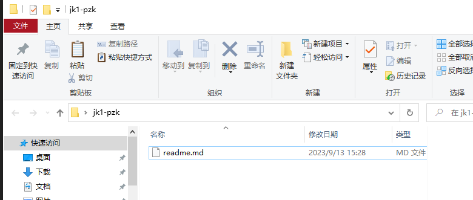
   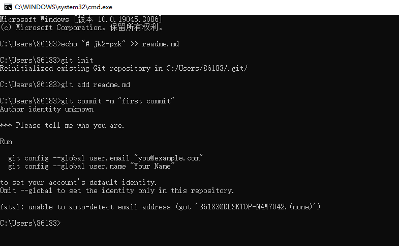
   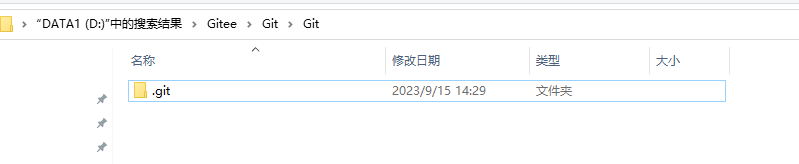
   ```shell
   echo "# jk1-pzk" >> readme.md
   git init
   git add readme.md
   git commit -m "first commit"
   ```
   
## 2. 创建git远程仓库

   在git上创建一个仓库，执行以下命令即可

   ```shell
   git branch -M main
   git remote add origin git@github.com:blackpengzk/jk1-pzk.git
   git push -u origin main
   ```
   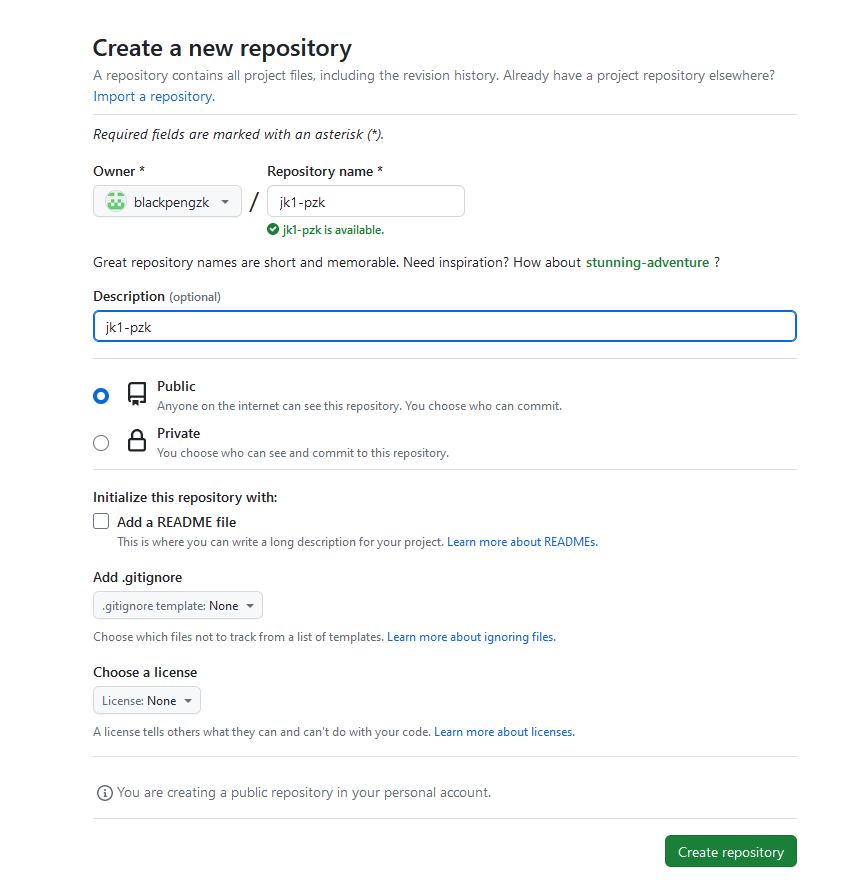

## 3. 添加开发者

   

## 4. 克隆仓库到本地

   以我的github仓库为例，执行以下命令即可克隆

   ```shell
   git clone git@github.com:blackpengzk/jk1-pzk.git
   ```

## 5. 添加资料到本地仓库

   先将需要上传的资料放进已经初始化的仓库中，然后执行`git add .`将他们添加到git仓库的暂存区，然后执行`git status`查看已经添加到暂存区的文件列表以及它们的状态，然后执行`git commit -m "改动的信息或提示"`将他们添加到本地仓库。
   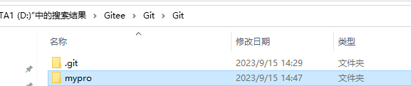

## 6. 提交数据

   ```shell
   git commit -m "改动的信息或提示"
   ```

## 7. 推送数据

   ```shell
   git push
   ```

## 8. 拉取数据

   ```shell
   git pull
   ```

## 9. 项目开源
在设置中将仓库改为public
## 10. 上传文件到github
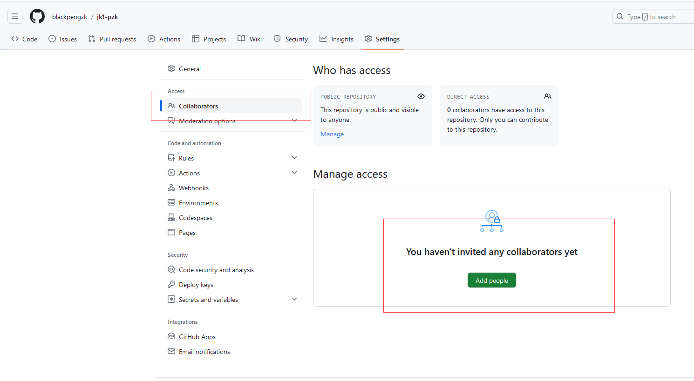
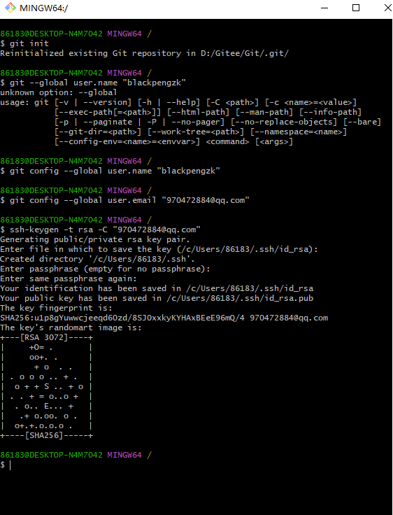
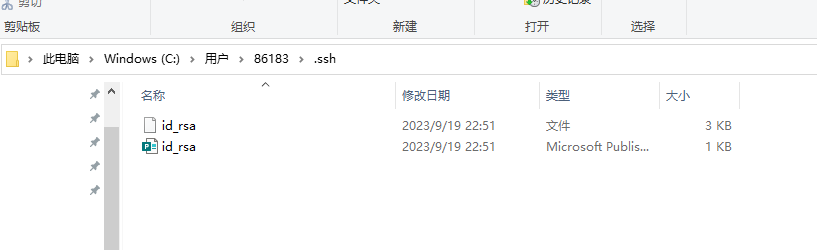
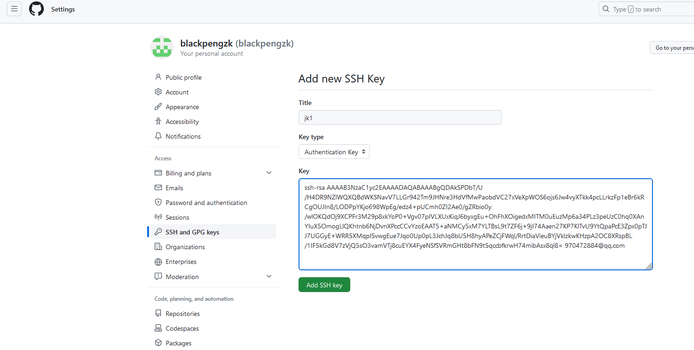
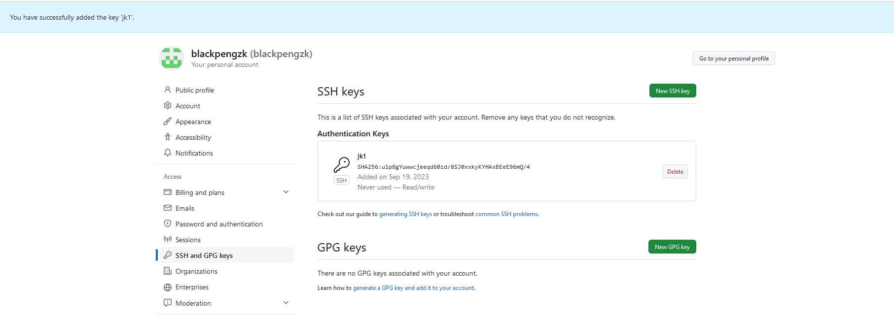
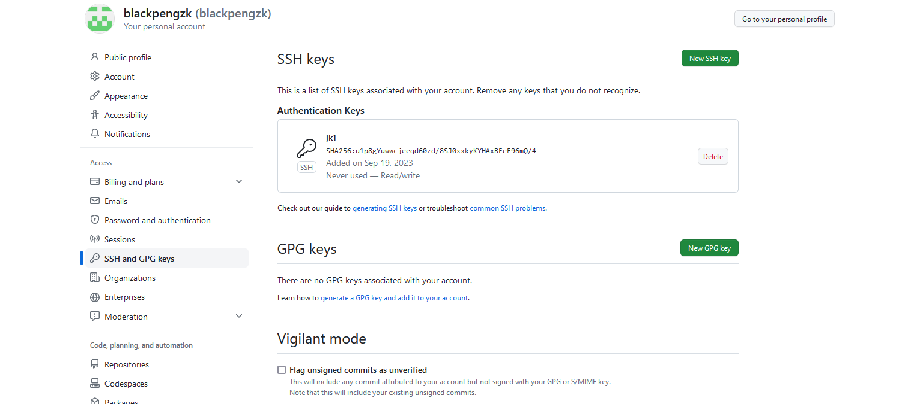